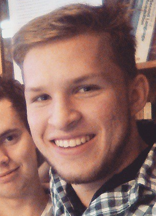

# Dagbok för Carl Wingårdh

OSPP (1DT096) 2015 - Grupp 04

## Vecka 16

Uppgift: Muntlig och skriftlig presentation.
Timmar: 12:45
Reflektion: Har gått smidigt. Lite dåligt samvete att jag var helt väck under helgen, men det gick bra ändå.

##### Måndag

11:15 - 12:15

Vi mötte efter föreläsningen för att spåna idéer. 
Vi kom fram till fyra idéer.
 1. Airport Booking
 2. Stock Trader
 3. Firechat Simulation
 4. Network encryption

Själv är jag mest intresserad i flygplatsbokningen. 
Vi har bestämt att möta imorn vid 9:30 för att bestämma och börja slänga ihop presentationen. 

##### Tisdag

10:00 - 13:00

Vi började med den muntliga och skriftliga presentationen. Vi började få ner våra idéer i skriftlig form samtidigt som vi pratar genom det så att vi får en bra idé om vad vi ska göra. 

##### Onsdag

13:00 - 15:45

Vi mötte i projectrummet för att göra klart vår muntilga presentation. Jag skrev in allt jag kände att vi kunde prata om. Tillsammans ändrade vi på system architekturen eftersom jag kände att den inte riktigt representerade tanken bakom vårt program. Den första diagrammen visade simulationen och GUIn på motsatta sidor om back-end delen, och i den förbättrade designen var simulationen och GUIn närmare varandra för att representera att de är väldigt lika ur back-endens synpunkt. Oskar la också till databas noden för att representera att den inte kommer vara inbakad i back-enden. 

Wenting tog upp en massa bra punkter om tanken bakom våran plan, för den var lite ofokuserad, men efter hennes oron kom fram så fick vi en bättre idé om exakt vad vi vill lösa och vilken potentiell klient vi har. 

Vid dagens slut så delade vi upp alla slides, jag kände vid denna punkt att jag har en väldigt bra idé om projektet eftersom jag kände att jag kunde prata om vilken del som helst. De två delarna som jag kommer behöva lära mig lite om är databas-delen och själv java lösningen, men Oskar och Lucas har försäkrat att det inte kommer vara för jobbigt att lära. 

##### Torsdag

10:00 - 14:00

Muntlig presentation av idéer. 

14:00 - 16:00

Efter presentationen jobbade jag med den skriftliga rapporten. Eftersom jag kommer vara upptagen hela helgen så har vi kommit fram till att jag jobbar så mycket jag kan idag, samt lite om jag hinner imorn, så får jag dispans under helgen att fokusera på mina åtagande på nationen.

##### Fredag

Nationen

## Vecka 17

Uppgift: Peer review, reflektion och prototyp. 
Timmar: 6:30
Reflektion: Att få information om hemtentan förstörde verkligen min plan för veckan. Jag hade knutit upp mig på nationsarbete och en fest på onsdag och torsdag som inte skulle vara ett problem eftersom jag skulle arbete med gruppen under dagen, men eftersom jag helt plötsligt hade en tenta att skriva så hade jag ingen tid för projektet. 

##### Måndag

13:15 - 15:45

Vi hade möte med Karl idag. Jag tycker det gick bra, han hade många bra sätt att vägleda oss på. Vi kom fram till att det var viktigt att dela upp arbetet och formellt strukturera vårt jobb för denna vecka. Efter mötet satt vi och började dela upp uppgifter. Under detta mötet planerade vi saker som skulle forskas inför mötet imorn, då vi ska bestämma hur vi ska göra allt som behövs inför progress meeting 1. 

##### Tisdag

14:00 - 16:30

Vi hade inte riktigt det mötet som jag hade förväntat, istället satt vi och jobbade på peer review grejen. Jag skrev väldigt mycket på den, nästan allt i del A och C. Jag fick reda idag att en omtenta för Datajuridiken är schemalagd imorgon så jag kommer behöva arbeta på den på onsdag och torsdag. 

##### Onsdag

Jag fick reda på Tisdag om en hemtenta som skulle in på Fredag, så jag sa till gruppen att jag inte kommer hinna jobba på projektet under de nästa tre dagarna. 

##### Torsdag

Hemtenta

##### Fredag

Hemtenta

##### Lördag

11:30 - 13:00

Jobbade lite hemifrån med formattering och dokumentation. Det var ett effektivt sätt att försöka komma ikapp med vad resten av laget har jobbat med (har också pratat med dem lite och läst genom deras dagböcker).

## Vecka 18

##### Måndag

13:30 - 15:15

Gick på milstolpemöte 1. Vi satt sen och bestämde lite om hur valborgsveckan kommer se ut. 

##### Tisdag

13:30 - 15:30

Jag och Andreas satt och jobbade lite på servern och simulationen. Jag har läst på så mycket jag kan om gen_tcp. Jag skrev en alternativ lösning till hur vi hanterar kopplingen mellan två enheter. Eftersom det bara var jag och Andreas så kunde jag dock inte diskutera den med nån. Jag gör väl det genom Facebook. 

##### Onsdag

##### Torsdag

##### Fredag

## Vecka 19

##### Måndag

5:40

10:00 - 15:40

Jobbade med Lucas för att få Erlang och Java att prata med varandra. Kom ganska långt med att skicka från Erlang till Java. Nästa steg är att skicka från Java till Erlang, vilket jag tror kommer bli lite problematiskt (eftersom jag inte riktigt känner mig säker i vad Java kommer skicka för nåt).

##### Tisdag

##### Onsdag

##### Torsdag

##### Fredag

4:30 

11:00 - 15:30

Jobbade hemifrån på en prototyp för Erlang backend. Jag har lyckats få en server terminal att hantera flera andra client terminaler samtidigt. Det lyckades och jag ska applicera detta på det egentliga programmet. 

## Vecka 20

##### Måndag

5:00

08:45 - 09:45, 13:00 - 17:00

Jobbade på morgonen och eftermiddagen på min prototyp. Har fått en fungerande prototype och har applicerat min prototyp på den egentliga servern. 

##### Tisdag

4:00

11:00 - 15:00

Nu har vi en server som svarar på meddelanden. Jag har gjort en seperat fil som hanterar paketen, detta är för att skapa en gräns mellan snackandet och tänkandet i servern. 

##### Onsdag

##### Torsdag

##### Fredag

## Vecka 21

##### Måndag

10:00 - 16:00

Möte med Karl. Kändes lite tråkigt och omitverat. Men Karl gav oss den spark i röven vi behövde och vi strukturerade vårt arbete på ett sätt som har gjort att det hela känns betydligt bättre. Vi har klippt bort väldigt mycket, men det känns som att det är för vårt eget bästa. 

##### Tisdag

11:00 - 16:00

Jag och Lucas har nu strukturerat hur våra meddelanden ska se ut. Jag har också dokumenterat hur booking_agent ska formattera sina svar så att jag kan börja översätta dess meddelanden. Kommer kanske brancha ut och använda mig av hårdkodade svar för att testa functionalitet. 

##### Onsdag

10:00 - 17:00

Jobbade mycket med Oskar för att få booking agent att prata med databas. Han har nu tagit över den delen av projektet och det känns väldit skönt. Att tolka meddelanden och formattera dem tar mycket längre tid än jag förväntade mig. 

##### Torsdag

10:30 - 17:00

Fortsatte med att tolka och formattera paket. När jag har gjort klart detta tänker jag hårdkoda lite svar från booking agent och försöka sätta ihop en server som ger svar. 

##### Fredag

##### Söndag

Satt och kodade lite och förberedde för presentationen. 

## Vecka 22

##### Måndag

##### Tisdag

##### Onsdag

##### Torsdag

##### Fredag

## Vecka 23

##### Måndag

##### Tisdag

##### Onsdag

##### Torsdag

##### Fredag
