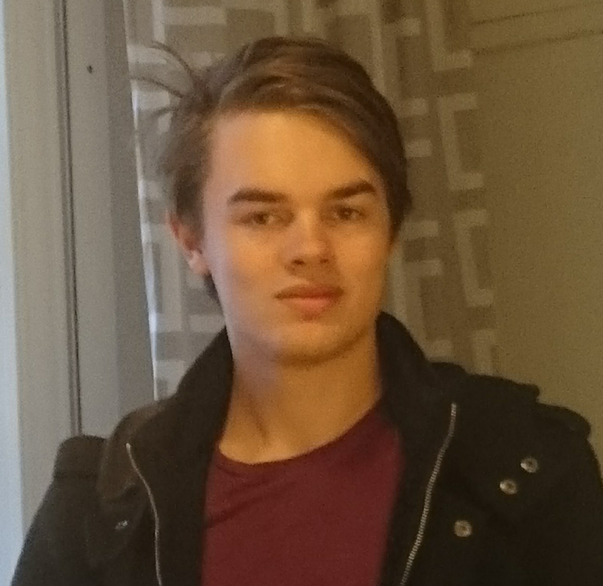
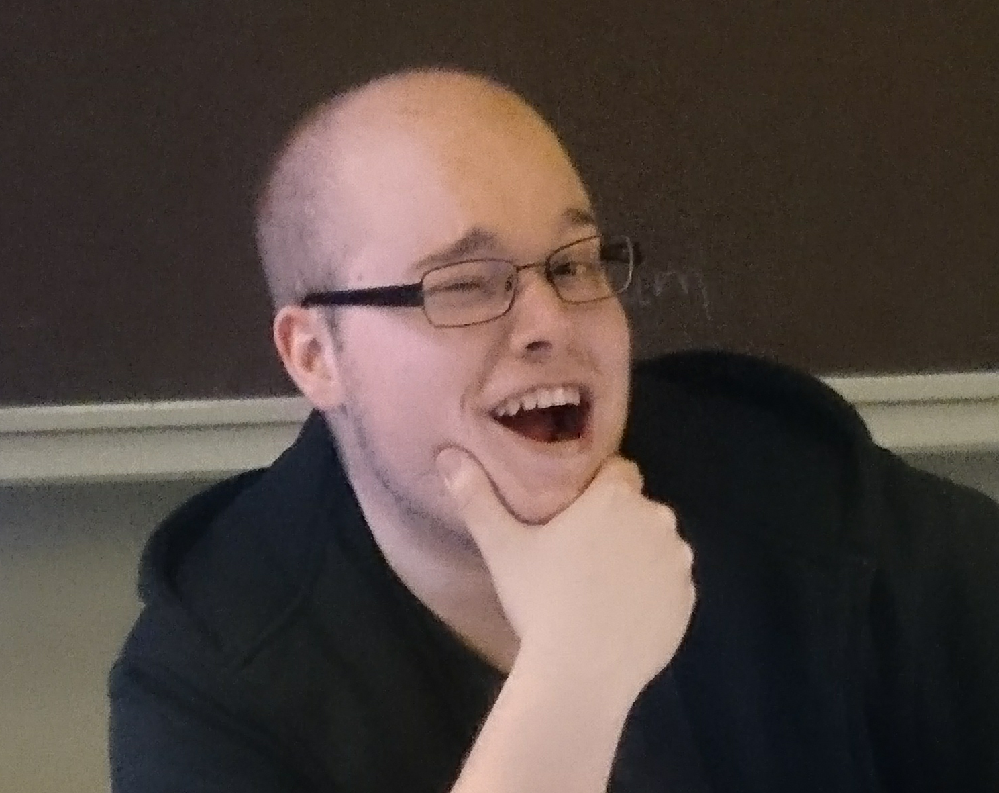

# Medlemmar

OSPP (1DT096) 2015 - Grupp 04

Bild                                       | Förnamn               | Efternamn | Personnummer | Användarnamn (Github)
-------------------------------------------|-----------------------|-----------|--------------|----------------------
  | [Andreas](#andreasrubensson)  | Rubensson | 940722-6019  | `andreasrubensson`
  | [Carl](#användarnamn)  | Wingårdh | 930126-4694  | `Tw1stedL0gic`
  | [Erik](#användarnamn)  | Österberg | 930220-5571  | `slax32`
  | [Lucas](#användarnamn)  | Arnström | yymmdd-xxxx  | `användarnamn`
  | [Oskar](#omsala)  | Ahlberg | 841012-1498  | `omsala`
  | [Wen Ting](#chrisking2020)  | Jin | 870119-1804  | `chrisking2020`

## Andreas Rubensson

### Okänd talang

- Tränar ofta, hjälper till att rensa skallen

### Starka sidor

- planering
- samarbete
- research (söka och sammanställa information)
- rapportskrivande
- sprida glad laganda

### Personlig utveckling

- analys/design/specifikation
- problemlösning och algoritmer
- skriva kod utifrån färdig specifikation
- ledarskap
- dokumentation
- muntlig presentation

## Carl Wingårdh

### Okänd talang

 Jag sjunger i Smålands Herrensemble, håller i Smålands Teaterförening och är Smålands sånganförare. 
 Nämnde jag att jag är med i Smålands?

### Starka sidor

Jag bidrar mest med planering, research och fördjupning i specifika områden. 

### Personlig utveckling

 Jag hoppas att utveckla min dokumentation- och rapportskrivande. 

## Erik Österberg

### Okänd talang

### Starka sidor

> Kortfattad beskrivning över områden där du tror du har lättast att
> bidra till projektet, till exempel:

- analys/design/specifikation
- problemlösning och algoritmer
- skriva kod utifrån färdig specifikation
- planering
- samarbete
- ledarskap
- research (söka och sammanställa information)
- dokumentation
- rapportskrivande
- muntlig presentation
- lägg gärna till flera punkter ...

### Personlig utveckling

- analys/design/specifikation
- problemlösning och algoritmer
- skriva kod utifrån färdig specifikation
- planering
- samarbete
- ledarskap
- research (söka och sammanställa information)
- dokumentation
- rapportskrivande
- muntlig presentation
- lägg gärna till flera punkter ...

## Lucas Arnström

### Okänd talang

Gaming.

### Starka sidor

Problemlösning och design.

### Personlig utveckling

Debuggning med valfritt debugger verktyg.

## Oskar Ahlberg

### Okänd talang

Sitter med i ett gäng med olika föreningar, samt är gammal scout, har också en fallenhet för historia samt strategispel

### Starka sidor

Bra på att styra upp saker samt har jobbat med ett antal projkt tididgare.
Anser att jag har ett strukturerat tänkade samt problemlösningsmetodik 
har bland annat varit med i en projektgrupp som annordnade ett scoutläger för ca 21000 deltagare.

### Personlig utveckling

Att forsätta att lära mig nya saker inom SC och att ta möjlighetet att lära sig ett nytt språk eller att vidareutvecka min kunskaps bas i c eller java.

## Jin Wen Ting

### Okänd talang

Matematik

### Starka sidor

Matematik

### Personlig utveckling

Under projektet hoppas jag förutom att bli ännu bättre på mina redan
starka sidor även ges möjlighet att utveckla följande färdigheter,
till exempel:

- analys/design/specifikation
- problemlösning och algoritmer
- skriva kod utifrån färdig specifikation
- planering
- samarbete
- ledarskap
- research (söka och sammanställa information)
- dokumentation
- rapportskrivande
- muntlig presentation
- lägg gärna till flera punkter ...
