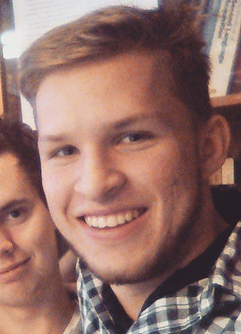

# Medlemmar

OSPP (1DT096) 2015 - Grupp 04

> Ändra XX till numret på gruppen.

> Tag foton av alla medlemmar i gruppen. Varje foto skall visa
> personen framifrån från axlarna och uppåt. Spara bilderna i mappen
> `/meta/images/`.

> Fyll sedan i tabellen nedan. Tabellen skall vara sorterad på förnamn.

Bild                                       | Förnamn               | Efternamn | Personnummer | Användarnamn (Github)
-------------------------------------------|-----------------------|-----------|--------------|----------------------
  | [Andreas](#andreasrubensson)  | Rubensson | 940722-6019  | `andreasrubensson`
  | [Carl](#användarnamn)  | Wingårdh | 930126-4694  | `Tw1stedL0gic`
  | [Erik](#användarnamn)  | Österberg | yymmdd-xxxx  | `användarnamn`
  | [Lucas](#användarnamn)  | Arnström | yymmdd-xxxx  | `användarnamn`
  | [Oskar](#användarnamn)  | Ahlberg | yymmdd-xxxx  | `användarnamn`
  | [Wen Ting](#chrisking2020)  | Jin | 870119-1804  | `chrisking2020`

> Utgå sedan från mallen nedan och skapa ett avsnitt för varje medlem
i gruppen sorterade i bokstavsordning  

## Andreas Rubensson

### Okänd talang

> Beskriv kortfattad något du gillar att göra vid sidan av dina
> studier.

- Tränar ofta, hjälper till att rensa skallen

### Starka sidor

> Kortfattad beskrivning över områden där du tror du har lättast att
> bidra till projektet, till exempel:

- planering
- samarbete
- research (söka och sammanställa information)
- rapportskrivande
- sprida glad laganda

### Personlig utveckling

> Under projektet hoppas jag förutom att bli ännu bättre på mina redan
> starka sidor även ges möjlighet att utveckla följande färdigheter,
> till exempel:

- analys/design/specifikation
- problemlösning och algoritmer
- skriva kod utifrån färdig specifikation
- ledarskap
- dokumentation
- muntlig presentation

## Carl Wingårdh

### Okänd talang

> Jag sjunger i Smålands Herrensemble, håller i Smålands Teaterförening och är Smålands sånganförare. 
> Nämnde jag att jag är med i Smålands?

### Starka sidor

> Jag bidrar mest med planering, research och fördjupning i specifika områden. 

### Personlig utveckling

> Jag hoppas att utveckla min dokumentation- och rapportskrivande. 

## Erik Österberg

### Okänd talang

> Beskriv kortfattad något du gillar att göra vid sidan av dina
> studier.

### Starka sidor

> Kortfattad beskrivning över områden där du tror du har lättast att
> bidra till projektet, till exempel:

- analys/design/specifikation
- problemlösning och algoritmer
- skriva kod utifrån färdig specifikation
- planering
- samarbete
- ledarskap
- research (söka och sammanställa information)
- dokumentation
- rapportskrivande
- muntlig presentation
- lägg gärna till flera punkter ...

### Personlig utveckling

> Under projektet hoppas jag förutom att bli ännu bättre på mina redan
> starka sidor även ges möjlighet att utveckla följande färdigheter,
> till exempel:

- analys/design/specifikation
- problemlösning och algoritmer
- skriva kod utifrån färdig specifikation
- planering
- samarbete
- ledarskap
- research (söka och sammanställa information)
- dokumentation
- rapportskrivande
- muntlig presentation
- lägg gärna till flera punkter ...

## Lucas Arnström

### Okänd talang

Gaming.

### Starka sidor

Problemlösning och design.

### Personlig utveckling

Debuggning med valfritt debugger verktyg.

## Oskar Ahlberg

### Okänd talang

> Beskriv kortfattad något du gillar att göra vid sidan av dina
> studier.

### Starka sidor

> Kortfattad beskrivning över områden där du tror du har lättast att
> bidra till projektet, till exempel:

- analys/design/specifikation
- problemlösning och algoritmer
- skriva kod utifrån färdig specifikation
- planering
- samarbete
- ledarskap
- research (söka och sammanställa information)
- dokumentation
- rapportskrivande
- muntlig presentation
- lägg gärna till flera punkter ...

### Personlig utveckling

> Under projektet hoppas jag förutom att bli ännu bättre på mina redan
> starka sidor även ges möjlighet att utveckla följande färdigheter,
> till exempel:

- analys/design/specifikation
- problemlösning och algoritmer
- skriva kod utifrån färdig specifikation
- planering
- samarbete
- ledarskap
- research (söka och sammanställa information)
- dokumentation
- rapportskrivande
- muntlig presentation
- lägg gärna till flera punkter ...

## Jin Wen Ting

### Okänd talang

> Beskriv kortfattad något du gillar att göra vid sidan av dina
> studier.

### Starka sidor

> Kortfattad beskrivning över områden där du tror du har lättast att
> bidra till projektet, till exempel:

- analys/design/specifikation
- problemlösning och algoritmer
- skriva kod utifrån färdig specifikation
- planering
- samarbete
- ledarskap
- research (söka och sammanställa information)
- dokumentation
- rapportskrivande
- muntlig presentation
- lägg gärna till flera punkter ...

### Personlig utveckling

> Under projektet hoppas jag förutom att bli ännu bättre på mina redan
> starka sidor även ges möjlighet att utveckla följande färdigheter,
> till exempel:

- analys/design/specifikation
- problemlösning och algoritmer
- skriva kod utifrån färdig specifikation
- planering
- samarbete
- ledarskap
- research (söka och sammanställa information)
- dokumentation
- rapportskrivande
- muntlig presentation
- lägg gärna till flera punkter ...
